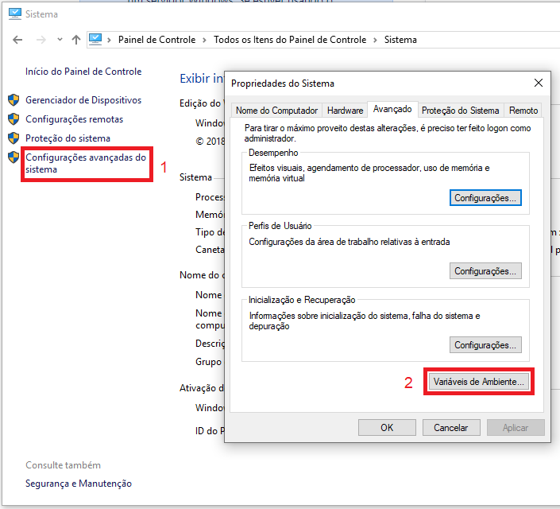

<table border="1">
    <tr>
        <th></th>
        <th colspan=3>INSTRUÇÃO DE TRABALHO</th>
    </tr>
    <tr>
        <th>Código</th>
        <th>Data Elaboração</th>
        <th>Data Revisão</th>
        <th>Versão</th>
    </tr>
    <tr style="text-align: center;">
        <td>ITINS-01-01-001</td>
        <td>28/09/2020</td>
        <td>28/09/2020</td>
        <td>1</td>
    </tr>
</table>

# IT - INSTAÇÃO ANDROID SDK

## Tarefa: Instalação do JDK

### **1. Resultado Esperado**

Ter o Flutter instalado e configurado para desenvolvimento mobile e web.

----------
### **2. Responsabilidades**

Programador

----------
### **3. Material Necessário**

- Notebook
- Conexão com a internet
- Acesso administrador no sistema operacional
- Android SDK
- Gradle

----------
### **4. Observações / Informações Adicionais** 

----------
### **5. Descrição da Atividade**

**Passo 1: Download**

Faça o download da versão mais recente do Flutter no ***Beta channel***. [Link para download](https://flutter.dev/docs/development/tools/sdk/releases).

**Passo 2: Instalar**

Crie uma pasta chamada **Flutter** na raiz do disco local e faça a extração conteúdo da pasta **flutter** do arquivo compactado para dentro dela.

**Passo 3: Configurar**

Abra o ***PowerShell*** na pasta `C:\Flutter\bin`.

Entre o comando `flutter doctor --android-licenses` e aceite as licensas do SDK.

Utilizando o comando `flutter config --no-analytics` para desativar a coleta de estatísticas.

Ative o suporte web pelo comando `flutter config --enable-web`.

Atualize os pacotes para que sejam compatíveis com a configuração web utilizando `flutter update-packages`.

**Passo 4: Variáveis**

Configure as variáveis de ambiente para que apontem ao SDK.
Vá para **Painel de controle** > **Sistema** > **Configurações avançadas do sistema**

Sob **Variáveis do sistema**, selecione ***Path***, clique em ***Editar*** e então em ***Procurar***.

Navegue até a pasta onde foi descompactado o Flutter, selecione a pasta ***bin*** e dê ***Ok***.

**Passo 5: Plugins**

Com essas configurações é possível utilizar as seguintes ferramentas:

- Android Studio
- Intellij Community
- Visual Studio Code

Para o Android Studio e Intellij faça:

1. Abra as configurações dos plugins (**Configure > Plugins**)
2. Selecione o plugin **Flutter** e clique em ***Install***
3. Clique em sim quando for solicitado para instalar o plugin do Dart
4. Reinicie a IDE quando for solicitado

Para o Visual Studio Code:

1. Vá em **Extensions**
2. Pesquise por Flutter
3. Selecione na lista e instale
4. Também será instalado o plugin do Dart
5. Abra a Command Palette (**View > Command Palette**)
6. Digite doctor e selecione ***Flutter: Run Flutter Doctor***
7. Verifique o resultado.