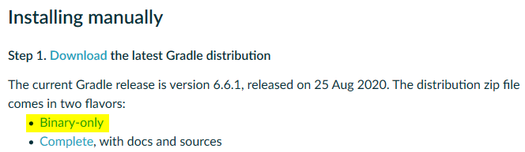
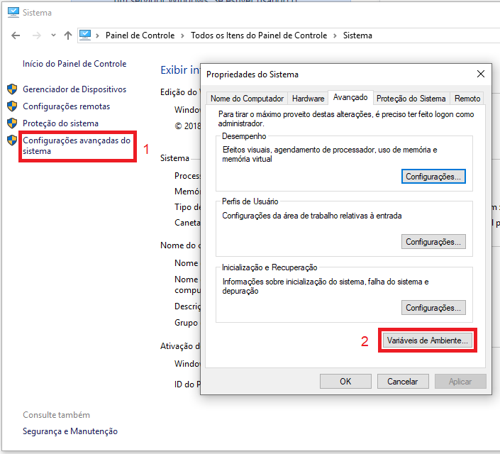

<table border="1">
    <tr>
        <th></th>
        <th colspan=3>INSTRUÇÃO DE TRABALHO</th>
    </tr>
    <tr>
        <th>Código</th>
        <th>Data Elaboração</th>
        <th>Data Revisão</th>
        <th>Versão</th>
    </tr>
    <tr style="text-align: center;">
        <td>ITINS-01-01-001</td>
        <td>28/09/2020</td>
        <td>28/09/2020</td>
        <td>1</td>
    </tr>
</table>

# IT - INSTAÇÃO GRADLE

## Tarefa: Instalação do Gradle

### **1. Resultado Esperado**

Ter o Gradle instalado e configurado.

----------
### **2. Responsabilidades**

Programador

----------
### **3. Material Necessário**

- Notebook
- Conexão com a internet
- Acesso administrador no sistema operacional
- OpenJDK ou JDK

----------
### **4. Observações / Informações Adicionais** 

----------
### **5. Descrição da Atividade**

#### **Passo 1: Download**

Faça o download da versão mais recente do Gradle. [Link para download](https://gradle.org/install/#manually).

#### **Passo 2: Extração**

Crie uma pasta chamada **Gradle** na raiz do disco local. Extraia o conteudo da pasta ***gradle-X.X.X*** para esta pasta recém criada.

#### **Passo 3: Variáveis**

Para configurar as variáveis do sistema, vá para **Painel de controle** > **Sistema** > **Configurações avançadas do sistema** > **Avançado** > **Variáveis de Ambiente...**

Sob a seção **Variáveis do sistema**, selecione ***Path***, clique em ***Editar*** e então em ***Procurar***. 
Navegue até a pasta do Gradle, selecione a pasta ***bin*** e dê ***Ok*** em todas as janelas.

----------
### Histórico de Revisões
<table border="1">
    <tr>
        <th>Versão</th>
        <th>Data</th>
        <th>Alteração</th>
        <th>Edição</th>
        <th>Revisão</th>
        <th>Aprovação</th>
    </tr>
    <tr style="text-align: center;">
        <td>1.0</td>
        <td>01/10/2020</td>
        <td>Versão Inicial</td>
        <td>Lucas</td>
        <td>-</td>
        <td>-</td>
    </tr>
</table>