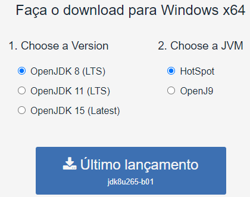
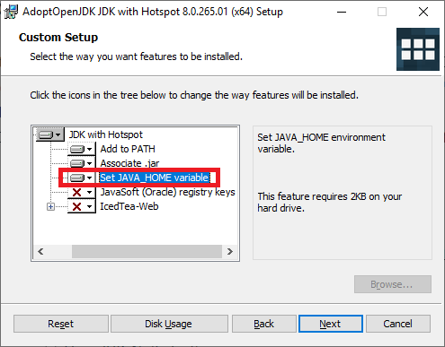

<table border="1">
    <tr>
        <th></th>
        <th colspan=3>INSTRUÇÃO DE TRABALHO</th>
    </tr>
    <tr>
        <th>Código</th>
        <th>Data Elaboração</th>
        <th>Data Revisão</th>
        <th>Versão</th>
    </tr>
    <tr style="text-align: center;">
        <td>ITINS-01-01-001</td>
        <td>28/09/2020</td>
        <td>28/09/2020</td>
        <td>1</td>
    </tr>
</table>

# IT - INSTAÇÃO JDK

## Tarefa: Instalação do JDK

### **1. Resultado Esperado**

Ter o JDK instalado e com as variáveis de ambiente configuradas.

----------
### **2. Responsabilidades**

Programador

----------
### **3. Material Necessário**

- Notebook
- Conexão com a internet
- Acesso administrador no sistema operacional

----------
### **4. Observações / Informações Adicionais** 

----------
### **5. Descrição da Atividade**

**Passo 1: Download**

Faça o download do instalador do openJDK selecionando a versão *OpenJDK 8 (LTS)* e JVM *HotSpot*. [Link para download](https://adoptopenjdk.net/).

**Passo 2: Instalação**

Execute a instalação e na tela de customização marque para configurar a variável JAVA_HOME:

----------
### Histórico de Revisões
<table border="1">
    <tr>
        <th>Versão</th>
        <th>Data</th>
        <th>Alteração</th>
        <th>Responsável</th>
        <th>Revisor</th>
        <th>Aprovação</th>
    </tr>
    <tr style="text-align: center;">
        <td>1.0</td>
        <td>01/10/2020</td>
        <td>Versão Inicial</td>
        <td>Lucas</td>
        <td>-</td>
        <td>-</td>
    </tr>
</table>