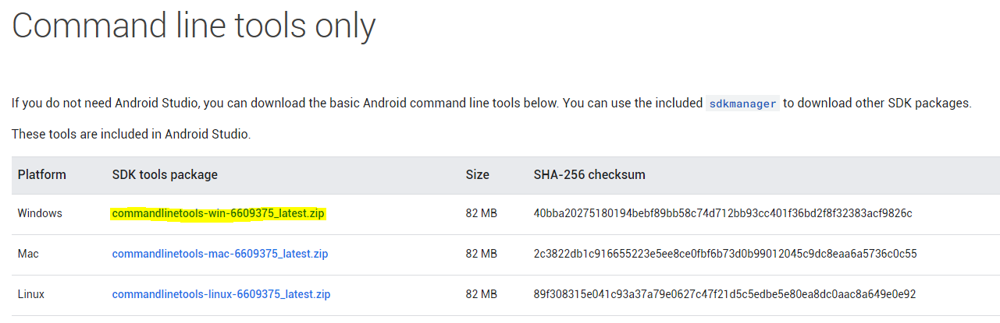

<table border="1">
    <tr>
        <th></th>
        <th colspan=3>INSTRUÇÃO DE TRABALHO</th>
    </tr>
    <tr>
        <th>Código</th>
        <th>Data Elaboração</th>
        <th>Data Revisão</th>
        <th>Versão</th>
    </tr>
    <tr style="text-align: center;">
        <td>ITINS-01-01-001</td>
        <td>28/09/2020</td>
        <td>28/09/2020</td>
        <td>1</td>
    </tr>
</table>

# IT - INSTAÇÃO ANDROID SDK

## Tarefa: Instalação do Android SDK

### **1. Resultado Esperado**

Ter o SDK do Android instalado e com as variáveis de ambiente configuradas.

----------
### **2. Responsabilidades**

Programador

----------
### **3. Material Necessário**

- Notebook
- Conexão com a internet
- Acesso administrador no sistema operacional
- OpenJDK ou JDK

----------
### **4. Observações / Informações Adicionais** 

----------
### **5. Descrição da Atividade**

#### **Passo 1: Download**

Faça o download do pacote de ferramentas de linha de comando do android. [Link para download](https://developer.android.com/studio#command-tools).



#### **Passo 2: Extração**

Crie uma pasta chamada **Android** na raiz do disco local e crie outra pasta chamada **cmdline-tools** dentro dela, então faça a extração dos arquivos dentro desta.

#### **Passo 3: Instalação**

Abra o ***PowerShell*** na pasta `C:\Android\cmdline-tools\tools\bin`.

Entre o comando `.\sdkmanager.bat --licenses` e aceite as licenças do SDK.

Utilizando o comando `.\sdkmanager.bat --list` verifique qual a última versão dos pacotes ***Platform*** e ***Build-Tools***.

Faça a instalação dos pacotes utilizando os comandos abaixo com os números das últimas versões.
```
.\sdkmanager.bat platform-tools
.\sdkmanager.bat emulator
.\sdkmanager.bat "platforms;android-30" "build-tools;30.0.2"
```

#### **Passo 4: Variáveis**

Para configurar as variáveis do sistema, vá para **Painel de controle** > **Sistema** > **Configurações avançadas do sistema** > **Avançado** > **Variáveis de Ambiente...**


Sob a seção **Variáveis de usuário**, clique em **Novo**

No nome da variável coloque ANDROID_SDK_ROOT.<br>
E no valor coloque o caminho para o diretório das ferramentas `C:\Android\tools`.

Crie uma nova variável com nome ANDROID_HOME.<br>
E no valor coloque o caminho para o diretório do android `C:\Android`.

#### **Passo 5: CFG**

Navegue até a pasta `%USERPROFILE%\.android` e crie um arquivo vazio nomeado `repositories.cfg`

----------
### Histórico de Revisões
<table border="1">
    <tr>
        <th>Versão</th>
        <th>Data</th>
        <th>Alteração</th>
        <th>Responsável</th>
        <th>Revisor</th>
        <th>Aprovação</th>
    </tr>
    <tr style="text-align: center;">
        <td>1.0</td>
        <td>01/10/2020</td>
        <td>Versão Inicial</td>
        <td>Lucas</td>
        <td>-</td>
        <td>-</td>
    </tr>
</table>