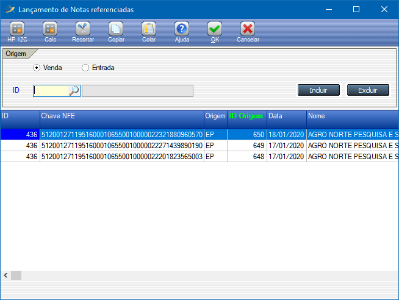

<table border="1">
    <tr>
        <th></th>
        <th colspan=3>INSTRUÇÃO DE TRABALHO</th>
    </tr>
    <tr>
        <th>Código</th>
        <th>Data Elaboração</th>
        <th>Data Revisão</th>
        <th>Versão</th>
    </tr>
    <tr style="text-align: center;">
        <td>ITINS-01-01-001</td>
        <td>28/09/2020</td>
        <td>28/09/2020</td>
        <td>1</td>
    </tr>
</table>

# IT - INSTAÇÃO JDK

## Tarefa: Instalação do JDK

### **1. Resultado Esperado**

Ter o JDK instalado e com as variáveis de ambiente configuradas.

### **2. Responsabilidades**

Programador

### **3. Material Necessário**

- Notebook
- Conexão com a internet
- Acesso administrador no sistema operacional

### **4. Observações / Informações Adicionais** 

### **5. Descrição da Atividade**

**Passo 1:**
Acessar a tela de lançamentos do sistema

